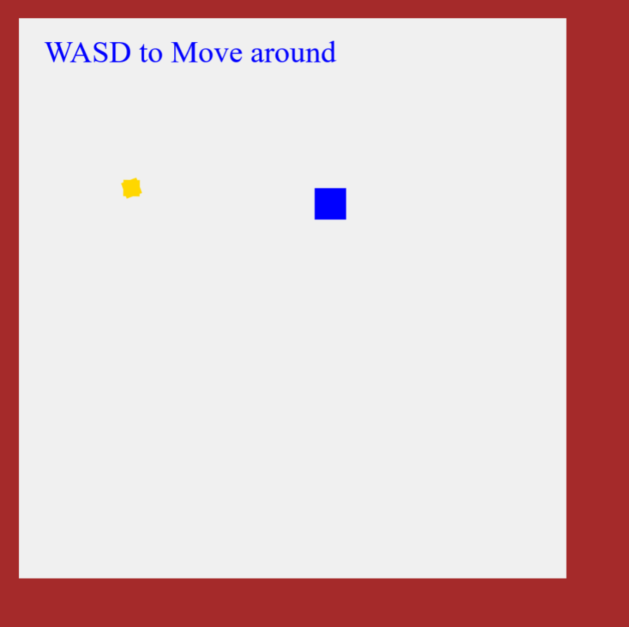

# [Example of a game in my React Game Engine (click here to see)](https://legoguy32109.github.io/ReactGameEngine/)

The power of a game engine from within a React Component, it can be added to any existing React project and utilizes the canvas to display visuals.



## Keyboard listener

```javascript
// Keeps a array of current keys being pressed
let keysActive = [];

// Attach keyboard listeners when page renders
React.useEffect(() => {
 document.addEventListener("keydown", detectKeyAction, true);
 document.addEventListener("keyup", detectKeyAction, true);
});

// keep array of keysActive updated with the current keys being held
const detectKeyAction = (e) => {
 let keyUp = e.type === "keyup";
 let keyDown = e.type === "keydown";
 if (keyDown && !keysActive.includes(e.key)) {
  keysActive = [...keysActive, e.key];
 }
 if (keyUp) {
  keysActive = keysActive.filter((key) => key !== e.key);
 }
};
```

The keysActive array is an array that gets updated with each character being pressed on the keyboard. Instead of having to remember the ascii value, I can simply check `if(keysActive.includes("a"))` and my function runs instantly. I think this is a much easier approach for development, and not having to worry about a long list of potential variables for keys, especially if the game designer doesn't choose to use too many. I ran into the issue of having multiple of the same key being added to the array, so that's why you need to check if the active key isn't already included. Or else you could slow the game down with an array being updated every frame with the same letter.

## Moving the walls around

```javascript
// Information about the score and walls
let worldInfo = {
 score: 0,
 walls: {
  north: {
   pos: 30,
   moving: false,
   shrinking: false,
   max: 300,
   min: 25,
   speed: 0.2,
  },
  south: {
   pos: 920,
   moving: false,
   shrinking: false,
   max: 900,
   min: 600,
   speed: 1,
  },
  west: {
   pos: 30,
   moving: false,
   shrinking: false,
   max: 300,
   min: 10,
   speed: 0.7,
  },
  east: {
   pos: 900,
   moving: false,
   shrinking: false,
   max: 900,
   min: 700,
   speed: 0.4,
  },
 },
};

function walls() {
 // draw walls
 ctx.fillStyle = "brown";
 ctx.fillRect(0, worldInfo.walls.south.pos, c.width, c.height); // south
 ctx.fillRect(0, 0, c.width, worldInfo.walls.north.pos); // north
 ctx.fillRect(0, 0, worldInfo.walls.west.pos, c.height); // west
 ctx.fillRect(worldInfo.walls.east.pos, 0, c.width, c.height); // east

 // Triggering wall movement at a certain score
 if (!worldInfo.walls.east.moving && worldInfo.score > 4) {
  worldInfo.walls.east.moving = true;
  worldInfo.walls.east.shrinking = true;
 }
 if (!worldInfo.walls.south.moving && worldInfo.score > 15) {
  worldInfo.walls.south.moving = true;
  worldInfo.walls.south.shrinking = false;
 }
 if (!worldInfo.walls.west.moving && worldInfo.score > 30) {
  worldInfo.walls.west.moving = true;
  worldInfo.walls.west.shrinking = false;
 }
 if (!worldInfo.walls.north.moving && worldInfo.score > 40) {
  worldInfo.walls.north.moving = true;
  worldInfo.walls.north.shrinking = false;
 }

 // SPEED UP WALLS FOR INFINITY
 if (worldInfo.score > 60) {
  worldInfo.walls.west.speed = worldInfo.score / 60;
  worldInfo.walls.north.speed = worldInfo.score / 100;
  worldInfo.walls.south.speed = worldInfo.score / 55;
  worldInfo.walls.east.speed = worldInfo.score / 120;
 }

 // checking each wall's movement, switching direction if neccessary
 Object.keys(worldInfo.walls).forEach((direction) => {
  if (worldInfo.walls[direction].moving) {
   collectableOutOfBounds(direction);
   if (worldInfo.walls[direction].shrinking) {
    worldInfo.walls[direction].pos -= worldInfo.walls[direction].speed;
    if (worldInfo.walls[direction].pos < worldInfo.walls[direction].min) {
     worldInfo.walls[direction].shrinking = false;
    }
   } else {
    worldInfo.walls[direction].pos += worldInfo.walls[direction].speed;
    if (worldInfo.walls[direction].pos > worldInfo.walls[direction].max) {
     worldInfo.walls[direction].shrinking = true;
    }
   }
  }
 });
}
```

Initially the walls functioned as a border and I had the player cube use them to bounce off of. I then thought of them moving or twitching to cause the player to bounce in the opposite direction. Eventually, I liked the idea of the walls moving in to enclose the player and make navigation difficult, so now the walls will start moving as you progress through the game. The best part is that the game is designed to be infinite, with the walls slowly getting faster as your score gets higher after score 60.

## Stop walls from moving over collectable

```javascript
// Stop moving walls from moving over collectable
function collectableOutOfBounds(direction) {
 switch (direction) {
  case "south":
   if (collectableInfo.y > worldInfo.walls.south.pos) {
    worldInfo.walls.south.shrinking = false;
   }
   break;
  case "east":
   if (collectableInfo.x > worldInfo.walls.east.pos) {
    worldInfo.walls.east.shrinking = false;
   }
   break;
  case "west":
   if (collectableInfo.x < worldInfo.walls.west.pos) {
    worldInfo.walls.west.shrinking = true;
   }
   break;
  case "north":
   if (collectableInfo.y < worldInfo.walls.north.pos) {
    worldInfo.walls.north.shrinking = true;
   }
   break;
  default:
   break;
 }
}
```

A bug encoutered in gameplay is the walls might move over the collectable and prevent the player from picking it up. I was trying to view it as a feature and use it as a challenge for the player, but I realized that it just wasn't fun waiting for the wall to move away. This way the walls switch direction if they hit the collectable. The East and South walls actually need to grow instead of shrink to get away from the collectable.

## UI Elements

```javascript
// Intro text and score
if (worldInfo.score === 0) {
 ctx.fillStyle = "blue";
 ctx.font = "49px serif";
 ctx.fillText("WASD to Move around", 70, 100);
} else {
 ctx.fillStyle = "gray";
 ctx.font = "300px serif";
 ctx.fillText(
  worldInfo.score,
  (worldInfo.walls.east.pos - worldInfo.walls.west.pos) / 2 - 110,
  (worldInfo.walls.south.pos - worldInfo.walls.north.pos) / 2 + 100
 );
}

// debug log toggle
if (showLog) {
 ctx.fillStyle = "white";
 ctx.font = "13px serif";
 ctx.fillText(JSON.stringify(playerInfo), 10, 20);
}
```

The UI elements are drawn to the canvas thanks to the fillText method. The debug log can be toggled thanks to a button outside of the canvas and is controlled by the React state showLog. The score text is interesting, as it remains centered no matter where the walls move, as it's position is the average inbetween the 4 walls. The adjustments after the division by 2 is done to center the text itself, text is drawn from the top left corner of the word. This way it looks more centered.

## Animating the Collectable

```javascript
// For animations in the game
let timer = 0;

React.useEffect(() => {
 // The lower two lines act as the update, repeating 60 times a second
 const t = d3.timer(update);
 return () => t.stop();
}, [update]);

function update() {
 // ...
 timer++;
 drawCollectable();
}

function drawCollectable() {
 ctx.fillStyle = "gold";
 // Stop moving walls from moving over collectable
 ctx.save();
 ctx.beginPath();
 ctx.translate(collectableInfo.x, collectableInfo.y);
 ctx.rotate(((timer % 360) * Math.PI) / 180);
 ctx.rect(
  -collectableInfo.size / 2,
  -collectableInfo.size / 2,
  collectableInfo.size,
  collectableInfo.size
 );
 // This modifer for the second square makes a nice rotational complement
 ctx.rotate((((-3.4 * timer) % 360) * Math.PI) / 180);
 ctx.rect(
  -collectableInfo.size / 2,
  -collectableInfo.size / 2,
  collectableInfo.size,
  collectableInfo.size
 );
 ctx.fill();
 ctx.restore();
}
```

The collectable is simply two squares, yet they rotate against each other to give a starry effect. This is done thanks to the variable timer, which increments 60 times a second. I was able to get this functionality thanks to the d3 package, which contains a timer method to call a function each frame. To get this functionality to work, I included the update function as a dependncy in the React callback. [To learn more, read this article](https://reactfordataviz.com/articles/game-loop-hooks/) where I found out how to get this game loop functionality.
