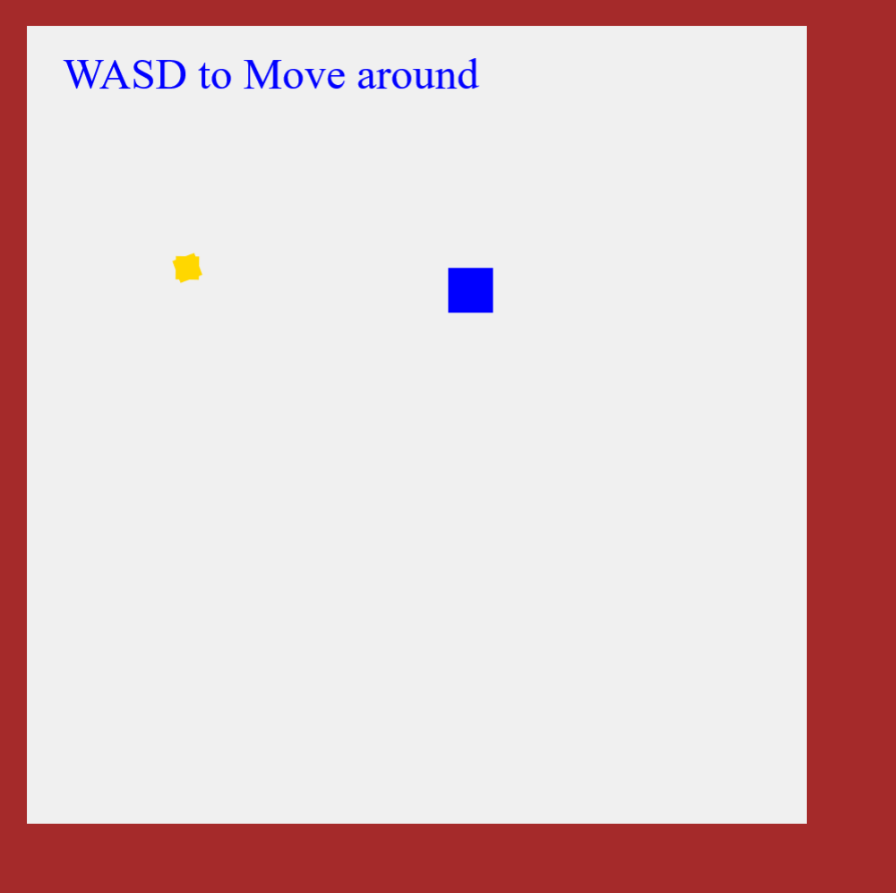

# [2D Graphics Demo on a \<canvas\> (click here to see)](https://legoguy32109.github.io/2DgraphicDemo/)
I've spent most of my time on the project trying to configure a mandlebrot set to be rendered on the canvas, and I'm excited to say that I accomplished that and highlighted it in the project. The buttons toggle the different renders on the canvas, check out the zoomed in version of the mendlebrot set! 
  


## Mandlebrot code
```javascript
// function to generate a mandlebrot set
function mandleBrot(scale, xcord, ycord) {
  for (let x = 0; x < c.width; x++) {
    for (let y = 0; y < c.height; y++) {
      pixel(x, y, "black");
      let dx = (x - c.width / 2) / scale + xcord;
      let dy = (y - c.height / 2) / scale + ycord;
      let a = dx;
      let b = dy;
      for (let t = 20; t < 200; t++) {
        let d = a * a - b * b + dx;
        b = 2 * (a * b) + dy;
        a = d;
        if (d > 200) {
          pixel(x, y, "rgb(" + t + "," + t * 3 + "," + t * 0.5 + ")");
          break;
        }
      }
    }
  }
}
// option to toggle between two mandlebrot generations
if (visibleInfo.showMandlebrot) {
  visibleInfo.showMandleZoomed ? mandleBrot(30000, -0.6, 0.62) : mandleBrot(390, -0.3, 0);
}
```
For each pixel on the canvas, a function is ran 20 times identifying the level of color to apply to that pixel by generating through a mandelbrot function. The paraemeters to that function change for each pixel in the canvas. You can zoom in on any part of the set by increaseing the scale variable to witness part of the inifinite generation of the set. The xcord and ycord translate the graph to the desired reigon.

## Rendering a wacky image
```javascript
// image displaying
if (visibleInfo.showImg) {
  const img = new Image();
  img.onload = () => {
    ctx.drawImage(img, 50, 50);
  }
  img.src = "./wow.jpeg";
}
```
The image is rendered from the Image constructor, and is drawn after the image itself is loaded on the page which is then drawn to the screen at the coordinates of 50,50 pixels. The image could be from a website but it renders faster if it's included in the project.

## Fun green smiley
```javascript
// little smiley face on the right
if (visibleInfo.showDraw) {
  ctx.strokeStyle = "green";
  ctx.lineWidth = 4;
  let addX = 700;
  let addY = 100;
  ctx.beginPath();
  ctx.arc(addX + 75, addY + 75, 60, 0, Math.PI * 2, true);
  ctx.moveTo(addX + 90, addY + 75);
  ctx.arc(addX + 75, addY + 75, 15, 0, Math.PI, false);
  ctx.moveTo(addX + 55, addY + 45);
  ctx.arc(addX + 50, addY + 45, 5, 0, Math.PI * 2, true);
  ctx.moveTo(addX + 105, addY + 45);
  ctx.arc(addX + 100, addY + 45, 5, 0, Math.PI * 2, true);
  ctx.stroke();
}
```
Using the moveTo and arc commands I was able to render a smiley face in any position I wanted thanks to the addX and Y parameters. His name is henry and he is green and 4 pixels thick.

## UI Elements
```javascript
// basic UI to toggle elements in demo
return (
  <>
    <h1>2D Graphics Demo</h1>
    <button onClick={() => setVisibleInfo((prevInfo) => ({ ...prevInfo, showBorder: !prevInfo.showBorder }))}>
      Border
    </button>
    <button title="Will lag website" onClick={() => setVisibleInfo((prevInfo) => ({ ...prevInfo, showMandlebrot: !prevInfo.showMandlebrot }))}>
      Mandlebrot
    </button>
    {visibleInfo.showMandlebrot && <button onClick={() => setVisibleInfo((prevInfo) => ({ ...prevInfo, showMandleZoomed: !prevInfo.showMandleZoomed }))}>
      Zoomed Mandlebrot set
    </button>}
    <button onClick={() => setVisibleInfo((prevInfo) => ({ ...prevInfo, showImg: !prevInfo.showImg }))}>
      Wacky Image
    </button>
    <button onClick={() => setVisibleInfo((prevInfo) => ({ ...prevInfo, showText: !prevInfo.showText }))}>
      Text
    </button>
    <button onClick={() => setVisibleInfo((prevInfo) => ({ ...prevInfo, showDraw: !prevInfo.showDraw }))}>
      Drawing
    </button>
  </>
);
```
The UI elements are powered by a React state object containing the booleans for all the individual options. Through JSX I can use an && operator to only render that button if the mandlebrot is already visible. The setVisibleInfo function passed to each button is functionally similar, where the only difference is which specific attribute they're changing and then keeping the rest of the attributes the same thanks to the splat operator `...prevInfo`.
